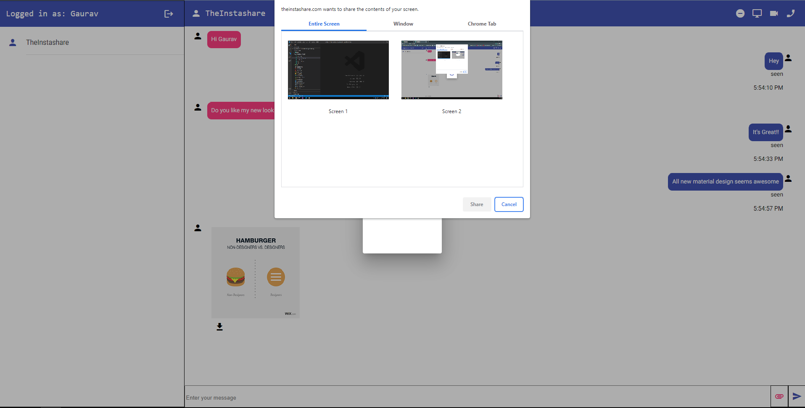

# theinstashare-web
theinstashare-web is the web version of TheInstashare application which is a suite of apps built on top of WebRTC tech stack. Every feature is powered by the underlying peer to peer streaming capabilities provided by WebRTC stack. Product is still very much under active development and currently host only one app for peer to peer communication but more apps will going to be added related to webrtc use-cases like group communication and peer to peer games etc.

### Try web version at - https://theinstashare.com/

Currently, it supports the following features -

### Major Features - 
- Text Chat
- Audio Chat
- Video Chat
- Screen Sharing
- File Sharing
- Remote Access

NOTE - For sharing remote access of your machine use desktop version of TheInstashare app.

```
https://github.com/gaurav10610/theinstashare-desktop
```

### Minor Features - 
- Flip Camera
- Do not disturb
- Mute
- Full-Screen Mode
- Shared Media Download
- Automatic reconnection attempt

### Steps to build the app -
``` 
npm install
ng build --prod 
```

### Features working status - 

| Features      | Windows       | Android  | IOS | Mac |
|:------------- |:-------------:|:--------:|:-------------:|:-----:|
| Text Chat | Yes | Yes | Yes | Yes |
| Audio Chat | Yes | Yes | | Yes |
| Video Chat | Yes | Yes | | Yes |
| Screen Sharing | Yes | NA | NA | |
| File Transfer | Yes | Yes | Yes | Yes |
| Access Remote Machine | Yes | Yes | Yes | Yes |

#### NOTE - All tests has been carried out using chrome browser.

### Screenshots -


 
 


### Preview - 
```https://youtu.be/zVNrG0JuXz4```

### Author - 
Gaurav Kumar Yadav

Email - gaurav10610@gmail.com

Linkedin - https://www.linkedin.com/in/gaurav-kumar-yadav-6125817a/